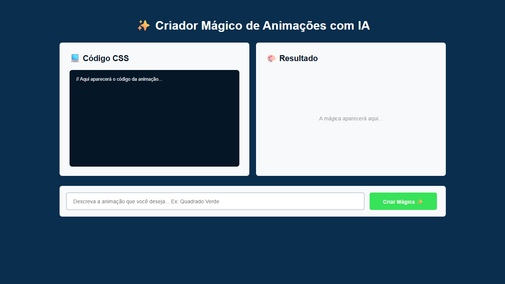
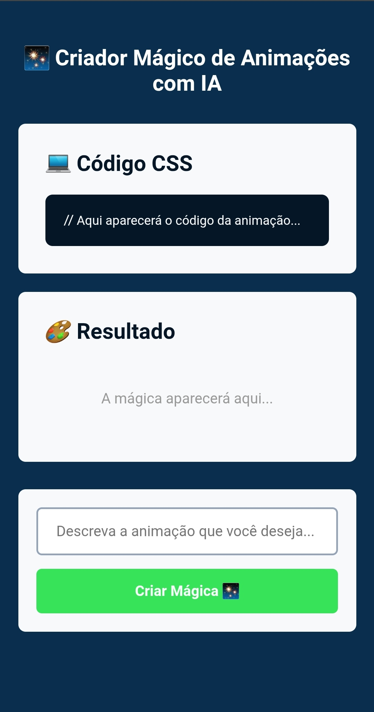

<div align="center">

# ✨ Criador Mágico de Animações com IA

**Descreva qualquer animação em português e veja o CSS gerado e renderizado em tempo real — direto no navegador.**



[](https://tuliovitor.github.io/criador-magico-ia)
[](https://developer.mozilla.org/pt-BR/docs/Web/HTML)
[](https://developer.mozilla.org/pt-BR/docs/Web/CSS)
[](https://developer.mozilla.org/pt-BR/docs/Web/JavaScript)
[](https://n8n.io)

</div>

---

## 📌 Sobre o projeto

O **Criador Mágico de Animações com IA** foi desenvolvido durante o evento **"Programador de IA em 7 Dias"** ministrado por Rodolfo Mori na DevClub. Ao longo da live, acompanhei e implementei cada etapa diretamente no meu notebook — com foco em entender o raciocínio por trás de cada decisão, não apenas replicar o resultado.

O projeto permite que o usuário descreva, em linguagem natural, qualquer animação CSS que queira criar. Essa descrição é enviada para um webhook N8N, que a processa via LLM e retorna três partes: o código CSS da animação, o HTML do elemento animado e os estilos injetáveis. Tudo é renderizado ao vivo na mesma página, sem recarregamento.

---

## 🎬 Demonstração

| Desktop | Mobile |
|---|---|
|  |  |

---

## ✨ Funcionalidades

- **Input em linguagem natural** — o usuário descreve a animação com suas próprias palavras (ex: "quadrado verde girando")
- **Integração com N8N** — webhook recebe a descrição e retorna `code`, `preview` e `style` via LLM
- **Renderização ao vivo** — o HTML do elemento animado é inserido diretamente na área de resultado
- **CSS injetado dinamicamente** — os estilos retornados pela IA são adicionados ao `<head>` do documento em tempo de execução via `insertAdjacentHTML`
- **Exibição do código gerado** — a área de código mostra o CSS exato que a IA produziu, legível pelo usuário
- **Layout lado a lado** — código e resultado ocupam metade da tela cada um no desktop, facilitando a comparação
- **Totalmente responsivo** — no mobile, os painéis empilham verticalmente e o botão ocupa a largura completa

---

## 🧱 Stack

| Tecnologia | Uso |
|---|---|
| HTML5 semântico | Estrutura com `main`, `section` e separação clara entre código e resultado |
| CSS3 com media queries | Layout flexbox lado a lado no desktop, coluna no mobile |
| JavaScript vanilla | Chamada ao webhook, parse da resposta e injeção dinâmica de HTML e CSS |
| N8N | Webhook que recebe a descrição em texto e retorna os três campos via LLM |

> Zero dependências de frontend. Nenhum framework. Um único `index.html`.

---

## 🗂️ Estrutura do projeto

```
criador-magico-ia/
├── index.html    # Estrutura com área de código, área de resultado e input
├── scripts.js    # Lógica: fetch ao webhook, parse da resposta e injeções no DOM
├── styles.css    # Layout flexbox, responsividade e estilos dos dois painéis
└── img/
    └── criadormagicoia.png   # Ícone do favicon
```

---

## 🧠 Decisões técnicas

### CSS dinâmico injetado via `insertAdjacentHTML`

A animação retornada pela IA não pode simplesmente ser atribuída a um elemento existente — ela precisa de uma regra `@keyframes` e de um seletor que ainda não existe no CSS estático. A solução foi injetar os estilos diretamente no `<head>` em tempo de execução:

```javascript
document.head.insertAdjacentHTML("beforeend", "<style>" + info.style + "</style>");
```

Isso permite que cada animação gerada coexista com as anteriores no documento sem conflito de seletores, já que a IA é responsável por nomear as classes de forma única a cada chamada.

---

### Parse duplo da resposta do N8N

A resposta do webhook retorna o campo `resposta` como uma **string JSON** dentro do JSON principal — ou seja, é necessário fazer dois parses sequenciais:

```javascript
let resultado = await resposta.json();       // parse do JSON externo
let info = JSON.parse(resultado.resposta);   // parse do JSON interno (string)
```

Esse padrão aparece quando o N8N serializa a resposta do LLM como texto antes de encapsulá-la no payload. Reconhecer esse comportamento e lidar com ele explicitamente evita o erro silencioso de tentar acessar `.code` em uma string.

---

### Separação entre `preview` e `style`

A IA retorna dois campos distintos para a renderização: `preview` (o HTML do elemento a ser animado) e `style` (as regras CSS que definem a animação). Essa separação permite que cada um seja tratado de forma independente:

```javascript
codigo.innerHTML = info.code;        // exibe o CSS legível para o usuário
areaResultado.innerHTML = info.preview;  // insere o elemento HTML animado
document.head.insertAdjacentHTML("beforeend", "<style>" + info.style + "</style>");
```

Se os três fossem um único bloco, não seria possível exibir o código legível separadamente da renderização — o que tornaria a experiência de aprendizado do app impossível.

---

## ⚙️ Configurando o N8N

O webhook recebe um `POST` com `{ pergunta: string }` e deve retornar:

```json
{
  "resposta": "{\"code\": \".box { animation: girar 1s infinite; }\", \"preview\": \"<div class='box'></div>\", \"style\": \".box { width: 60px; height: 60px; background: green; } @keyframes girar { to { transform: rotate(360deg); } }\"}"
}
```

> Atenção: o campo `resposta` é uma **string JSON escapada**, não um objeto direto. O N8N serializa a saída do LLM como texto antes de encapsulá-la no payload.

Para conectar ao seu N8N, substitua a URL no topo de `scripts.js`:

```javascript
let webhook = "https://seu-usuario.app.n8n.cloud/webhook/animacao-css";
```

---

## 📈 Processo de desenvolvimento

| Etapa | O que foi feito |
|---|---|
| 01 | Estrutura HTML com os dois painéis lado a lado e a seção de input |
| 02 | Layout CSS com flexbox e altura fixa nos painéis |
| 03 | Função `cliqueiNoBotao()` conectando ao webhook via `fetch` |
| 04 | Parse duplo da resposta do N8N e separação dos três campos |
| 05 | Injeção do `preview` na área de resultado e do `style` no `<head>` |
| 06 | Exibição do código CSS legível na área de código |
| 07 | Media queries para responsividade completa no mobile |

---

## 💡 O que eu aprenderia diferente

- Adicionaria um estado de **loading** visível enquanto o webhook processa — atualmente o botão não dá nenhum feedback visual durante a espera, o que pode confundir o usuário
- Implementaria um **tratamento de erro** com `try/catch` para lidar com falhas no fetch ou no parse do JSON — se o webhook estiver fora do ar ou retornar um formato inesperado, a tela simplesmente não atualiza sem nenhuma mensagem
- Teria usado `textContent` ao invés de `innerHTML` na área de código para exibir o CSS como texto literal, sem risco de o browser interpretar tags acidentais como HTML

---

## 👨‍💻 Autor

**TULIO VITOR**

[](https://linkedin.com/in/tuliovitor)
[](https://github.com/tuliovitor)

---

<div align="center">

Feito com muito ☕ e muita ✨

</div>
